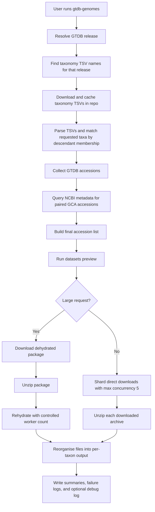

# Pipeline Concept

This document explains the intended end-to-end behaviour of `gtdb-genomes` before implementation starts.

## Purpose

`gtdb-genomes` is designed to translate GTDB taxon requests into genome downloads from NCBI. The key problem is that GTDB taxonomy tables identify genomes by assembly accession, while the actual data retrieval should be delegated to the NCBI `datasets` command-line tool.

The pipeline is designed around four priorities:

1. support historical and current GTDB releases
2. retrieve all matching genomes whenever possible
3. prefer `GCA` accessions when a paired GenBank accession exists
4. keep secrets out of logs and saved files

## High-Level Workflow

## Step-By-Step Concept

### 1. GTDB release discovery

The tool must not assume that all GTDB releases use the same file naming scheme.

The release resolver is expected to:

- accept friendly inputs such as `latest`, `214`, `226`, `220.0`, or `release220/220.0`
- resolve those into a concrete release path under the GTDB releases index
- inspect the release directory to discover which taxonomy TSVs actually exist

Historical naming variants that must be supported include:

- `bac_taxonomy_r80.tsv`
- `bac120_taxonomy_r214.tsv`
- `bac120_taxonomy.tsv`
- `ar122_taxonomy_r95.tsv`
- `ar53_taxonomy_r214.tsv`
- `ar53_taxonomy.tsv`

This discovery-driven approach avoids hardcoding one modern filename pattern and then failing on older GTDB releases.

### 2. Taxonomy TSV download and repo-local caching

The taxonomy TSVs are small enough to cache in the repository.

Planned cache behaviour:

- store files under `data/gtdb_taxonomy/<resolved_release>/`
- download only the files needed for the chosen release
- reuse the cached files on later runs
- keep the cache separate from user output directories

This design gives predictable local reuse and makes debugging easier because the exact GTDB input tables remain available after a run.

### 3. Taxon descendant matching

The user will provide one or more GTDB taxa with repeatable `--taxon`.

The planned matching rule is descendant membership:

- a genome matches when its GTDB lineage contains the requested token
- `g__Escherichia` selects all genomes under that GTDB genus
- `d__Bacteria` selects all bacterial genomes in the chosen release

This behaviour is more practical than exact-string matching because GTDB taxa are usually requested as lineage anchors rather than complete lineage strings.

### 4. Accession resolution and `GCA` preference

Each selected GTDB row provides an accession that becomes the starting point for download planning.

The accession resolution stage is designed to:

- retain the original GTDB accession as the source of truth for traceability
- ask NCBI for assembly metadata
- replace `GCF_*` with the paired `GCA_*` accession when a GenBank counterpart exists
- keep the original accession when no paired `GCA` accession is available

This gives the best possible coverage while still preferring `GCA` accessions where available.

### 5. Download-method choice

The tool will support three user-visible modes:

- `direct`
- `dehydrate`
- `auto`

In `auto` mode, the current planned policy is:

- run `datasets download genome accession --preview`
- if the request contains at least 1,000 genomes, use dehydrate/rehydrate
- if the previewed package exceeds 15 GB, use dehydrate/rehydrate
- otherwise use direct download

These thresholds are intended to keep smaller jobs simple while pushing very large jobs towards the workflow that NCBI recommends for large downloads.

### 6. Direct download sharding

When direct download is chosen, the tool is expected to:

- split the accession list into batches
- launch multiple `datasets download genome accession` jobs in parallel
- never exceed 5 concurrent download jobs, regardless of `--threads`

The direct-download cap is intentional. It limits server pressure while still allowing practical throughput improvements on large, but not enormous, requests.

### 7. Dehydrate and rehydrate flow

For larger requests, the tool should:

1. create one dehydrated package with `datasets`
2. unzip the package into a working directory
3. run `datasets rehydrate --directory <dir>`
4. control rehydrate worker count with `min(threads, 30)`

This keeps large transfers aligned with the intended `datasets` workflow and avoids running many independent direct downloads for large jobs.

### 8. Unzip and output reorganisation

The raw `datasets` package layout is useful internally, but not ideal as the final user-facing layout.

The planned output structure is:

- `OUTPUT/run_summary.tsv`
- `OUTPUT/accession_map.tsv`
- `OUTPUT/download_failures.tsv`
- `OUTPUT/taxon_summary.tsv`
- `OUTPUT/debug.log` when `--debug` is enabled
- `OUTPUT/taxa/<taxon_slug>/taxon_accessions.tsv`
- `OUTPUT/taxa/<taxon_slug>/<assembly_accession>/...`

Important rules:

- do not create a shared `OUTPUT/genomes/` directory
- duplicate genomes across taxa are copied into every matching taxon directory
- log every duplicate-copy action clearly
- keep summary files directly under `OUTPUT/`
- keep per-taxon manifest files directly under each taxon directory

This layout optimises for human browsing by taxon rather than for deduplicated storage.

## Logging, Debug Mode, and Secret Redaction

The planned implementation should use structured, explicit logging with careful secret handling.

Normal logging should describe:

- release resolution
- taxonomy file reuse or download
- number of matched genomes
- choice of direct vs dehydrate mode
- duplicate copy operations
- failures and skipped accessions

`--debug` should additionally record:

- redacted command lines
- timings for major phases
- batch sizes
- cache decisions
- copy and reorganisation details

The API key must:

- never be written to logs
- never be written to manifests or cache files
- never appear in the debug log

One residual risk remains: a literal key typed on the shell command line may still be exposed through shell history or operating-system process inspection outside the control of this tool.

## Why This Design

This pipeline separates the problem into small, predictable stages:

- GTDB is used for taxonomic selection
- NCBI metadata is used for accession refinement
- `datasets` is used for retrieval
- local reorganisation produces the final user-facing layout

That separation keeps the implementation modular, makes testing easier, and allows future extension without changing the overall model.
